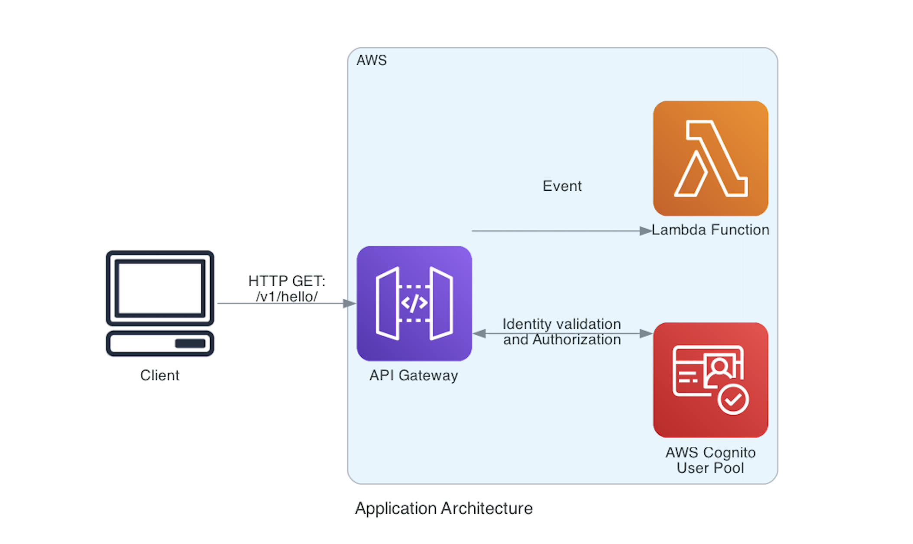

# Deploy de Infraestrutura de APIs Seguras com Amazon Cognito e AWS API Gateway com CDK



## Aplicação para demonstrar como criar uma arquitetura básica para autenticação de usuários e exposição de uma API na AWS utilizando o AWS Cloud Development Kit (CDK) Python.

### Que inclui:

- Um pool de usuários do Amazon Cognito para autenticação de usuários, com configurações de senha e atributos personalizados.
- Um cliente do Amazon Cognito para autenticação de aplicativos móveis ou web.
- Uma função Lambda que é invocada quando uma chamada é feita à API.
- Um autorizador de usuários do Amazon Cognito para proteger a API.
- Uma API RESTful integrada à função Lambda e protegida pelo autorizador do Amazon Cognito.

## Instruções para testar
Para criar manualmente um virtualenv no MacOS e Linux:

```
$ python3 -m venv .venv
```

Após o processo de inicialização ser concluído e o virtualenv ser criado, você pode usar as seguintes
etapas para ativar o seu virtualenv.

```
$ source .venv/bin/activate
```

Se você estiver na plataforma Windows, você ativaria o virtualenv assim:

```
% .venv\Scripts\activate.bat
```

Depois que o virtualenv estiver ativado, você pode instalar as dependências necessárias.

```
$ pip install -r requirements.txt
```

Neste ponto, você pode sintetizar o modelo do CloudFormation para este código.

```
$ cdk synth
```

## Comandos úteis

 * `cdk ls`          lista todas as pilhas no aplicativo
 * `cdk synth`       emite o modelo sintetizado do CloudFormation
 * `cdk deploy`      implementa esta pilha na sua conta/região AWS padrão
 * `cdk diff`        compara a pilha implantada com o estado atual
 * `cdk docs`        abre a documentação do CDK

Aproveite!
